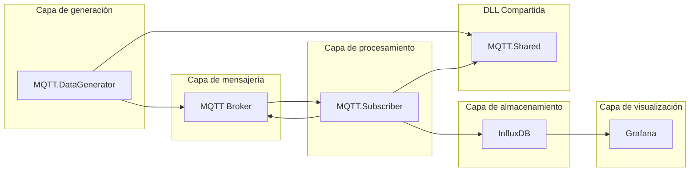

# Arquitectura del sistema



- **Capa de generación**: Sistema .NET genera los datos de los sensores.
- **Capa de mensajería**: Se usan mensajes MQTT para transmitir los datos de forma eficiente.
- **Capa de procesamiento**: Otro componente en .NET suscribe al broker MQTT y procesa los datos.
- **Capa de almacenamiento**: Los datos procesados se almacenan en InfluxDB.
- **Capa de visualización**: Grafana se conecta a InfluxDB para mostrar dashboards en tiempo real.

# 📝 Paso a paso Simulacion

Requisitos

- Docker
- Visual Studio

## 1. 🐋 Docker comopose

Dentro de

```
📁 /
├── 📁 Antares-Grafana-Test
│   └── 📁 Docker
|	  │   └── 🐋 docker-compose.yml
```

- Abrir una terminal y ejecutar

`docker-compose up --build`

## 2. 🛩️ Opcional - Revisar que lleguen los datos a MQTT

- Instalar [MQTT Explorer](https://mqtt-explorer.com/)

Datos de conexión:

```
Name: Mosquitto Local
Protocol: mqtt://
Host: localhost
port: 1884
```

## 3. 📊 Grafana

Abrir Grafana en [http://localhost:3000/login](http://localhost:3000/login)

Datos de inicio de sesion:

```
username: admin
password: admin123
```

### 📁 Configuración de base de datos

1. En el menú lateral izquierdo buscar **Connections** -> **Add new Connection**
2. **Search** -> **influxdb**

```
Name: influxdb
Query language: Flux
URL: http://influxdb:8086
Organization: Antares
Token: my-super-token
Default Bucket: my-bucket
```

1. Clic en **Save & Test**. Debería decir "Data source is working".

### 📈 Crear dashboards

#### 🌡️ **Temperatura por dispositivo (últimas 24 hs)**

```flux
from(bucket: "my-bucket")
  |> range(start: -1h)  // última hora, para evitar demasiados datos y que vaya más rápido
  |> filter(fn: (r) => r._measurement == "telemetry")
  |> filter(fn: (r) => r._field == "temperature")
  |> group(columns: ["device_id"])
  |> aggregateWindow(every: 5s, fn: mean, createEmpty: false)
  |> yield(name: "mean")
```

En la cabecera del grafico ajustar

1. Last 1 minute
2. Refresh 5 seconds AUTO

#### 🫗 Humedad (últimas 6 hs)

```flux
from(bucket: "my-bucket")
  |> range(start: -1h)
  |> filter(fn: (r) => r._measurement == "telemetry")
  |> filter(fn: (r) => r._field == "humidity")
  |> aggregateWindow(every: 5s, fn: mean, createEmpty: false)
  |> yield(name: "mean")
```

En la cabecera del grafico ajustar

1. Last 1 minute
2. Refresh 5 seconds AUTO

#### ## 💣 **Presión atmosférica actual por dispositivo**

Este panel muestra el último valor registrado por cada `device_id`:

```
from(bucket: "my-bucket")
  |> range(start: -10m)
  |> filter(fn: (r) => r._measurement == "telemetry")
  |> filter(fn: (r) => r._field == "pressure")
  |> aggregateWindow(every: 5s, fn: last, createEmpty: false)
  |> yield(name: "last")
```

En la cabecera del grafico ajustar

1. Last 1 minute
2. Refresh 5 seconds AUTO
